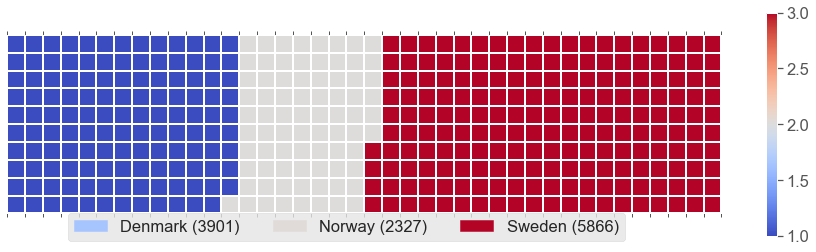
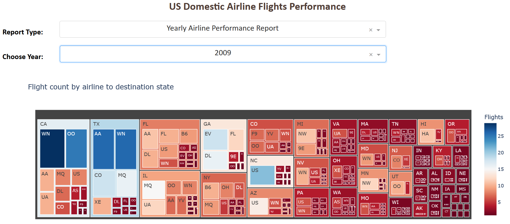

#  Data Visualization with Python

This project was part of IBM Data Science certificate. https://www.coursera.org/professional-certificates/ibm-data-science  
It was completed in May 2022. 
  

### **Canadian Immigration Dataset:  waffle chart, word cloud.** 

We improved the initial Notebook with better graphs.   We used a map of Canada and contour as a mask for the word cloud of immigration main countries of origin.  

|   Waffle Chart        |      Word Cloud     |
| ---         |   ---         |
|  
  
 | 
 
|

### **Generating Maps with Python** 

Maps with Folium with various options: Stamen Toner, Stamen Terrain,...    
Maps with markers: Visulaing features of San Francisco crime dataset.   
Maps with choropleth: Visualizing countries of origin, Canadian Immigration dataset.     

|   Waffle Chart        |      Word Cloud     |
| ---         |   ---         |
|  
  
 | 
 
|

#### [Waffle charts, Word cloud - Jupyter Notebook](https://github.com/DrStef/Data-Visualization-with-Python/blob/main/Waffle-Charts-Word-Clouds-and-Regression-Plots-v2.ipynb)

 
 

### **US Domestic Airline Flights Performance.** 

Analysis/Visualization with Dashboard including histograms, pie chart, map (choropleth), treemap. 
Improved presentation, and confusing line plots were replaced with histograms. 
Interactive Dashboard does not work with MyBinder. Notebook must be downloaded and run with proper libraries.     
 

  
  

#### [Dashboard - Jupyter Notebook](https://github.com/DrStef/Data-Visualization-with-Python/blob/main/US%20Domestic%20Airline%20Flights%20Performance_Dashboard_v3.ipynb)

