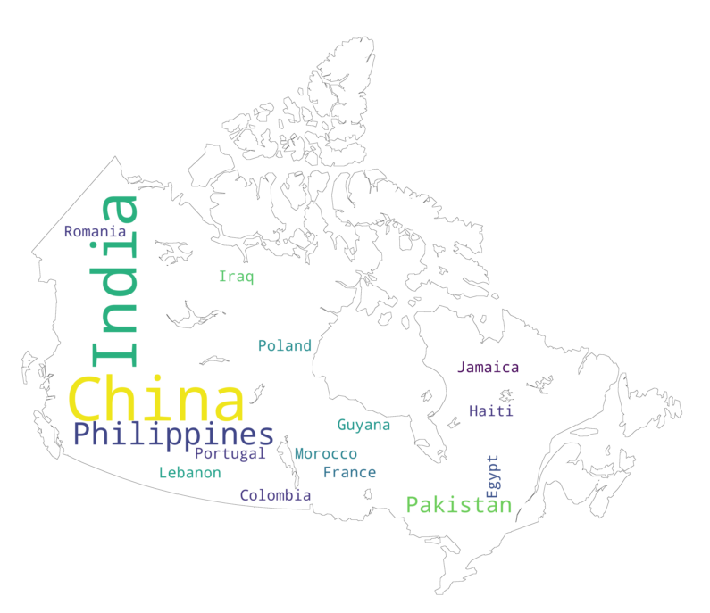

#  Data Visualization with Python

##### Data Visualization with Python 
This project is part of IBM Data Science certificate. https://www.coursera.org/professional-certificates/ibm-data-science

### Canadian Immigration Dataset:  wafle, word cloud. 

We improved the initial by adding better graphs using a Canada map as a mask for major immigration countries work cloud.  

|   Waffle Chart        |      Word Cloud     |
| ---         |   ---         |
|  
  
 | 
 
|

#### <ul>[Waffle charts, Word cloud - Jupyter Notebook](https://github.com/DrStef/Data-Visualization-with-Python/blob/main/Waffle-Charts-Word-Clouds-and-Regression-Plots-v2.ipynb)</ul>

### **Presentation of the project** 

The presentation covers all steps described in Jupyter Notebooks in following sections. From Data Collection, Analysis to prediction of launch succeess (succesful first stage landing) with classification algorithms. We draw a parallel between SpaceX Falcon9 and ArianeEspace Ariane5 (and coming Ariane6) that was dominating the market of commercial launches until SpaceX put an end to this domination thanks to the reusable boosters concept and induced cost reduction.     

#### <ul>[Presentation - pdf](https://github.com/DrStef/Applied_Data_Science_Capstone_SpaceX_IBM/blob/main/Stephane_Dedieu_ds-capstone-template-coursera_v9.pdf)</ul>

Presentation to be downloaded (15.6MB). Will not display on Github. 
#### <ul>[Presentation - pptx](https://github.com/DrStef/Applied_Data_Science_Capstone_SpaceX_IBM/blob/main/Stephane_Dedieu_ds-capstone-template-coursera_v9.pptx)</ul>

### **SpaceX Data Collection.**

Request to the SpaceX API.  
Clean the requested data. 

#### <ul>[SpaceX Data Collection - Jupyter Notebook](https://github.com/DrStef/Applied_Data_Science_Capstone_SpaceX_IBM/blob/main/GH_jupyter-labs-spacex-data-collection-api_v5.ipynb)</ul>

