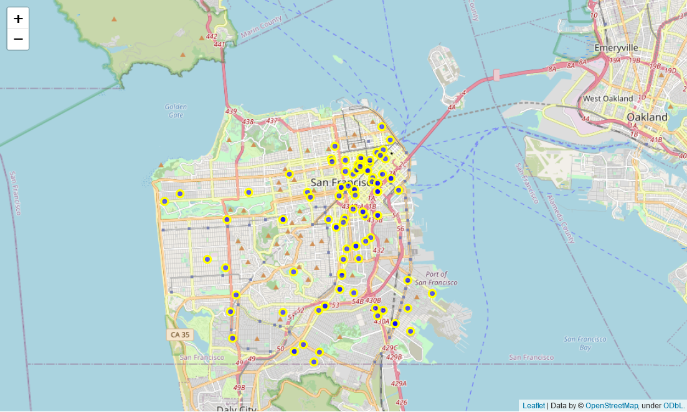
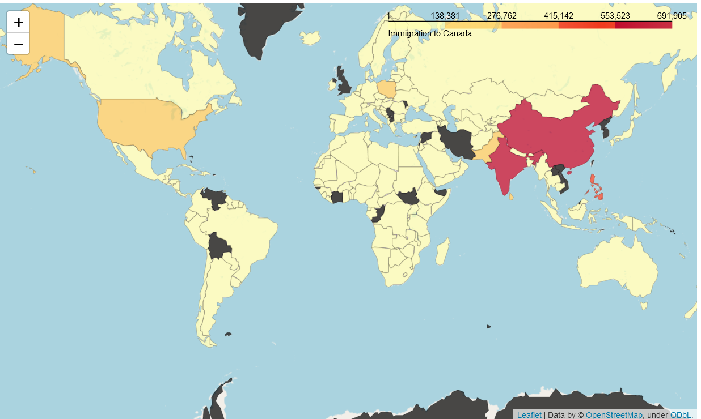

#  Data Visualization with Python

This project was part of IBM Data Science certificate. https://www.coursera.org/professional-certificates/ibm-data-science  

  
 

## **Canadian Immigration Dataset:  waffle chart, word cloud.** 

We improved the initial Notebook with better graphs.   We used a map of Canada and contour as a mask for the word cloud: immigration main countries of origin.  

|   
  
       |  
      |
| ---         |   ---         |
|  
<b> Waffle Chart </b>
  |  
<b> Word Cloud </b>
  |

#### [Waffle charts, Word cloud - Jupyter Notebook](https://github.com/DrStef/Data-Visualization-with-Python/blob/main/Waffle-Charts-Word-Clouds-and-Regression-Plots-v2.ipynb)

 
 

## **Generating Maps with Python** 

Maps with Folium. Various options: Stamen Toner, Stamen Terrain,...  
Maps with markers: Visualizing features of San Francisco crime dataset.   
Maps with choropleth: Visualizing countries of origin, Canadian Immigration dataset.     

|  
  
 | 
 
|
| ---                          |   ---         |
|  
<b> Folium with markers  </b> 
       |   
<b>  Choropleth </b> 
     |

#### [Maps: Folium - Choropleth - Jupyter Notebook](https://github.com/DrStef/Data-Visualization-with-Python/blob/main/Generating-Maps-with-Python_v2.ipynb)

The interactive version below is shared on Google Colab. Requires a Google Drive account. 
#### [Interactive Maps: Folium - Choropleth - Jupyter Notebook on GoogleColab](https://github.com/DrStef/Data-Visualization-with-Python/blob/main/Generating_Maps_with_Python_v4.ipynb)

 
 

## **US Domestic Airline Flights Performance.** 

Analysis/Visualization with Dashboard including histograms, pie chart, map (choropleth), treemap. 
Improved presentation, and confusing line plots were replaced with histograms. 

 

  
  

Interactive Dashboard does not work with MyBinder. It runs on Google Colab, but it requires a Google account.  
Notebook can be downloaded and run with proper libraries.  

#### [Dashboard - Jupyter Notebook](https://github.com/DrStef/Data-Visualization-with-Python/blob/main/US-Domestic-Airline-Flights-Performance_Dashboard_v3.ipynb)

Google colab. Execute the Notebook, and click on the "localhost" link below "Dash app running on". 
#### [Dashboard - GoogleColab](https://colab.research.google.com/drive/1KC7oAGeaOK1uuqT7V47LEaKZS1rM2jSo?usp=sharing)

